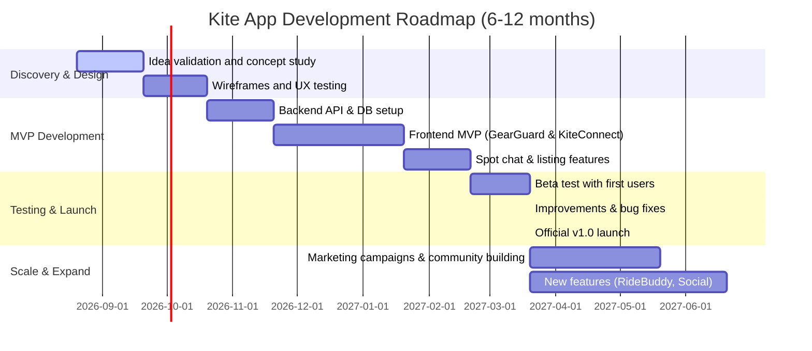

# Kitesurf App — Product & Research Guide

This guide combines the two source documents that inform the Kitesurf Community App:

1. **Part 1 — Full Project Context**: the current product, UX, technical, and design-system source of truth (originally `kitesurf-app-full-context-for-claude.md`).
2. **Part 2 — Market Research: App Concepts**: a deep-research market scan of kitesurf app ideas, translated from the original Dutch report (originally `deep-research-report.md`).

Part 1 is the authoritative plan for what to build and in what order. Part 2 is background research/inspiration — several of its concepts (e.g. gear marketplace, safety/SOS, spot community) map onto later phases of the Part 1 roadmap (Gear Passport/Marketplace, Safety, RideBuddy), but Part 1's phasing and "community first" principle should take precedence over anything in Part 2.

---

# Part 1 — Full Project Context

## 0. Purpose

This document is the current product, UX, technical, and design-system source of truth for the Kitesurf Community App.

The product is **not** intended to be a generic weather app, wind forecast app, webshop, marketplace, or jump tracker.

Core idea:

> **Who is riding, where are they riding, what is happening, and how can I join?**

The long-term product is a social/community layer around the complete kitesurfing journey.

---

## 1. Product Vision

Long-term journey:

```text
DISCOVER
   ↓
SPOT
   ↓
WHO'S RIDING?
   ↓
SESSION
   ↓
RIDE TOGETHER
   ↓
SESSION RECAP
   ↓
SPOT INTELLIGENCE
   ↓
SAFETY / GEAR / IDENTITY
   ↓
PERFORMANCE / PROGRESSION
```

The product should connect:

- Local kitesurf communities
- Spots
- Riders
- Sessions
- Group rides
- Spot history
- Community intelligence
- Safety
- Gear identity
- Kitesurf identity
- Performance

The product should feel like a **social operating layer for kitesurfing**, rather than another utility app.

---

## 2. Core Product Principle

The most important principle is:

> **Community first.**

Weather can support the product, but weather must not become the product.

The core user question should eventually be:

> **"I'm going kitesurfing. Let me open the app and see who is going."**

Everything else should strengthen that behavior.

---

## 3. Target Users

### Primary

- Recreational kitesurfers
- Intermediate kitesurfers
- Experienced riders
- Freeride riders
- Big Air riders
- Freestyle riders
- Wave riders
- Solo riders looking for riding partners
- Riders visiting unfamiliar spots

### Secondary

- Session organizers
- Local kite communities
- Kite schools
- Eventually shops and brands

---

## 4. Product Differentiation

Do NOT build the first version around:

- Weather forecasts
- Wind alerts
- A webshop
- A generic marketplace
- Jump tracking
- AI coaching
- Gear sales
- Complex GPS tracking

These can become supporting features later.

The initial differentiation is:

> **A place where kiters can see who is riding, plan sessions together, communicate around spots, and build a persistent community.**

---

## 5. Roadmap

### Phase 0 — Discovery & Validation

#### Goal

Validate the core problem before building the complete product.

#### Questions

1. Do kiters want to know who is riding?
2. Would they create a planned session?
3. Would they join another rider's session?
4. Would they use a spot-specific community?
5. What currently replaces this?
   - WhatsApp
   - Facebook groups
   - Telegram
   - Signal
   - Word of mouth
6. Why would they return?

#### Deliverables

- Product brief
- User personas
- Core user journeys
- Information architecture
- Initial database model
- Low-fidelity wireframes
- Clickable prototype
- Interview questions
- 5–10 real kitesurfer interviews

Do not aggressively move into V1 without evidence that the community/session problem is meaningful.

---

### Phase 1 — V1: Who's Riding?

#### Objective

Build the smallest useful version of the community.

#### Authentication

- Sign up
- Login
- Logout
- Password reset
- Authenticated route protection
- Auth state handling

#### Profile

- Username
- Avatar
- Skill level
- Riding disciplines
- Home spot
- Short bio
- Privacy settings

#### Spots

Start locally rather than creating a global database.

Example Dutch spots:

- IJmuiden
- Wijk aan Zee
- Zandvoort
- Noordwijk
- Scheveningen
- Muiderberg

Each spot:

- Name
- Coordinates
- Description
- Spot type
- Suitable disciplines
- Basic wind-direction metadata
- Photos
- Community

#### Rider Presence

A user can explicitly say:

> "I'm riding here."

Initial data:

- Spot
- Approximate time
- Optional duration
- Visibility

Example:

```text
IJmuiden

14 riders riding
6 riders planning
```

#### Privacy

Do **not** expose exact user GPS positions in V1.

Presence is a social status, not continuous tracking.

#### Spot Chat

Each spot gets a community chat.

Example:

```text
# IJmuiden

Mark:
Wind looks good from 15:00.

Lisa:
I'll be there around 16:30.

Tony:
Anyone doing big air today?
```

---

## 6. V1 Navigation

Recommended navigation:

```text
Home
Spots
Sessions
Messages
Profile
```

Mobile-first.

---

## 7. V1 Success Metrics

Track:

- Weekly active riders
- Riders checking a spot
- "I'm riding" actions
- Messages per active spot
- Returning users
- Sessions created
- Users joining another rider's activity

Most important:

> **Percentage of active users who interact with another kiter.**

---

## 8. Phase 1.5 — Sessions

### Objective

Turn rider presence into planned activity.

A session is a first-class product object, not merely a chat message.

Example:

```text
Create session

Spot
IJmuiden

Date
Saturday

Start
15:00

Duration
~2 hours

Style
Freeride

Max riders
10
```

### Features

- Create session
- Join session
- Leave session
- Participant list
- Session chat
- Session reminders
- Share session
- Upcoming sessions

Core loop:

```text
Spot
 ↓
Rider
 ↓
Session
 ↓
Join
 ↓
Chat
 ↓
Ride
```

This loop should work before major future features are added.

---

## 9. Phase 2 — V2: Session History & Community Intelligence

After a session:

```text
How was the session?

Wind       ★★★★★
Water      ★★★★☆
Crowd      ★★★☆☆
Conditions ★★★★★

Would ride again?
YES / NO

Add photos
```

Store:

- Spot
- Participants
- Date/time
- Duration
- Wind rating
- Water rating
- Crowd rating
- Overall condition rating
- Notes
- Photos

This creates community-generated historical data:

> **How the spot actually felt to kiters.**

---

## 10. Phase 2.5 — Spot Intelligence

Combine external forecast information with community data.

Example:

```text
IJmuiden

Forecast
18–24 kn

Community interest
23 riders

Historical sessions
87% good

Expected crowd
Medium

Best for
Freeride
Big Air
```

Weather remains supporting information.

The value is:

> Forecast + real community interest + historical community experience.

---

## 11. Phase 3 — V3: RideBuddy

Support:

- Normal sessions
- Downwinders
- Group rides
- Trips
- Events

Example:

```text
Scheveningen → Noordwijk

Downwinder

Sunday
11:00

7 / 8 riders
```

Features:

- Route
- Start spot
- End spot
- Date/time
- Maximum participants
- RSVP
- Waiting list
- Group chat
- GPX export
- Session reminders

Later:

- Route recommendations
- Wind-aware suggestions
- Automatic session proposals

---

## 12. Phase 3.5 — Safety

Only after the social/session system works.

Possible features:

- Optional live location
- Buddy tracking
- Session check-in/check-out
- Emergency contact
- SOS
- Last known position

Privacy must be explicit:

```text
Location sharing

○ Nobody
● Session members
○ Selected buddies
○ Emergency contact
```

Permanent live tracking must never be the default.

---

## 13. Phase 4 — V4: Gear Passport

Create a trusted gear identity layer.

Example:

```text
Duotone Rebel
9m
2025

Owner
Tony

Status
Active

Registered
2026

Owners
1
```

Features:

- Add gear
- Photos
- Serial number
- Ownership
- Condition
- Ownership transfer
- Lost/stolen status
- Gear history

Do **not** build the marketplace first.

Build trusted gear identity first.

---

## 14. Phase 4.5 — Gear Marketplace

Only after enough users and gear activity exist.

Features:

- Listings
- Search
- Filters
- Seller profiles
- Verified gear
- Lost/stolen checks
- Ownership transfer
- Reviews
- Messaging

Later:

- Payments
- Escrow
- Shipping
- Shops
- Professional sellers

---

## 15. Phase 5 — Kitesurf Passport

Persistent rider identity.

Example:

```text
TONY

Kitesurf Passport

184 sessions
17 spots
312 hours

Favourite spots
IJmuiden
Scheveningen
Tarifa

Disciplines
Freeride
Big Air

Riders met
82
```

Possible data:

- Sessions
- Spots
- Trips
- Gear
- Friends
- Achievements
- Photos
- Progression
- Riding history

---

## 16. Phase 6 — Performance

Later integrations may include:

- GPS
- Apple Watch
- Garmin
- WOO
- Surfr
- Hoolan
- Strava

Possible data:

- Distance
- Speed
- Airtime
- Jump height
- Session duration
- Route
- Progression

Differentiation:

> **Performance + conditions + spot + gear + community.**

Not simply another jump tracker.

---

## 17. Long-Term Roadmap

```text
V0 — Validation
 ↓
V1 — Community
 ↓
V1.5 — Sessions
 ↓
V2 — Session history
 ↓
V2.5 — Spot intelligence
 ↓
V3 — RideBuddy
 ↓
V3.5 — Safety
 ↓
V4 — Gear Passport
 ↓
V4.5 — Marketplace
 ↓
V5 — Kitesurf Passport
 ↓
V6 — Performance
 ↓
V7 — Personal intelligence / AI
```

---

## 18. Technology Stack

Intended stack:

- Next.js
- TypeScript
- Chakra UI
- GraphQL
- Supabase
- PostgreSQL
- Supabase Auth
- Supabase Storage
- Supabase Realtime
- Supabase Row Level Security

This stack is considered suitable for the planned product.

---

## 19. Technical Architecture

```text
┌──────────────────────────────┐
│          Next.js             │
│                              │
│ App Router                   │
│ React                        │
│ Chakra UI                    │
└──────────────┬───────────────┘
               │
             GraphQL
               │
┌──────────────▼───────────────┐
│       Application API        │
│                              │
│ Queries                      │
│ Mutations                    │
│ Authorization                │
│ Domain logic                 │
└──────────────┬───────────────┘
               │
┌──────────────▼───────────────┐
│          Supabase            │
│                              │
│ PostgreSQL                   │
│ Auth                         │
│ Storage                      │
│ Realtime                     │
│ RLS                          │
└──────────────────────────────┘
```

---

## 20. GraphQL Strategy

GraphQL should act as the application's domain API.

Example:

```graphql
query Spot($id: ID!) {
  spot(id: $id) {
    id
    name

    activeRiders {
      id
      username
      avatar
    }

    upcomingSessions {
      id
      title
      startTime

      participants {
        id
        username
      }
    }
  }
}
```

Mutation:

```graphql
mutation JoinSession($sessionId: ID!) {
  joinSession(sessionId: $sessionId) {
    id

    participants {
      id
      username
    }
  }
}
```

Use Supabase Realtime for:

- Chat
- Presence
- Live session updates
- Appropriate notifications

Do not force every realtime behavior through GraphQL subscriptions.

---

## 21. Initial Database Model

### V1

```text
profiles
├── id
├── username
├── avatar_url
├── skill_level
├── disciplines
├── home_spot_id
└── privacy_settings

spots
├── id
├── name
├── latitude
├── longitude
├── description
├── spot_type
└── metadata

spot_members
├── spot_id
└── user_id

spot_messages
├── id
├── spot_id
├── user_id
├── content
└── created_at

sessions
├── id
├── spot_id
├── creator_id
├── title
├── start_time
├── duration
├── style
└── max_participants

session_members
├── session_id
├── user_id
└── status

session_messages
├── id
├── session_id
├── user_id
├── content
└── created_at

session_recaps
├── session_id
├── wind_rating
├── water_rating
├── crowd_rating
├── condition_rating
└── notes
```

Later:

```text
gear
gear_ownership
gear_history
rides
ride_members
notifications
spot_conditions
session_tracks
session_jumps
achievements
```

---

## 22. Recommended Project Structure

```text
src/
├── app/
│   ├── (auth)/
│   ├── (app)/
│   │   ├── home/
│   │   ├── spots/
│   │   ├── sessions/
│   │   ├── messages/
│   │   └── profile/
│   └── api/
│
├── design-system/
│   ├── theme/
│   ├── primitives/
│   ├── components/
│   └── patterns/
│
├── components/
│   └── feature-specific components
│
├── features/
│   ├── spots/
│   ├── sessions/
│   ├── riders/
│   └── chat/
│
├── graphql/
│   ├── queries/
│   ├── mutations/
│   ├── fragments/
│   └── generated/
│
├── lib/
│   ├── supabase/
│   ├── auth/
│   ├── graphql/
│   └── validation/
│
└── config/
```

---

## 23. Development Workflow

For every feature:

```text
1. Define user problem
2. Define acceptance criteria
3. Design UX
4. Define database changes
5. Define GraphQL contract
6. Implement backend
7. Implement UI
8. Add tests
9. Test with real users
10. Measure usage
11. Decide: keep / improve / remove
```

Do not build large batches of unvalidated functionality.

---

## 24. Testing Strategy

### Unit

- Domain logic
- Validation
- Permissions
- Utility functions

### Integration

- GraphQL queries
- GraphQL mutations
- Supabase policies
- Session membership
- Chat permissions

### E2E

Critical flow:

```text
Register
→ Create profile
→ Open spot
→ Mark "I'm riding"
→ Create session
→ Join session
→ Send message
→ Complete session
→ Submit recap
```

---

## 25. Security & Privacy

Rules:

- Exact location is never public by default.
- Live location is opt-in.
- Store only necessary location data.
- Use Supabase RLS.
- Validate all GraphQL mutations server-side.
- Never trust client-provided user IDs.
- Users must be able to delete their account/data.
- Separate public profile data from private data.
- Build privacy settings before live location functionality.
- Permanent tracking must never be the default.

---

## 26. V1 UX / Wireframes

### Home

```text
┌──────────────────────────────┐
│  KITE APP                    │
│                              │
│  Good afternoon, Tony        │
│                              │
│  Your spots                  │
│                              │
│  ┌────────────────────────┐  │
│  │ IJMUIDEN               │  │
│  │                        │  │
│  │ 🟢 14 riding           │  │
│  │ 👥 6 planning          │  │
│  │                        │  │
│  │ [ View spot ]          │  │
│  └────────────────────────┘  │
│                              │
│  Upcoming sessions           │
│                              │
│  ┌────────────────────────┐  │
│  │ Saturday Session       │  │
│  │ IJmuiden · 15:00       │  │
│  │ 👥 8 riders            │  │
│  │ [ Join ]               │  │
│  └────────────────────────┘  │
│                              │
│  Home  Spots  Sessions Chat  │
└──────────────────────────────┘
```

### Spot

```text
┌──────────────────────────────┐
│ ← IJmuiden                   │
│                              │
│ [ Spot image / map ]         │
│                              │
│ IJmuiden                     │
│ North Holland                │
│                              │
│ 🟢 14 riding                 │
│ 👥 6 planning                │
│                              │
│ [ I'm riding ]               │
│                              │
│ Upcoming sessions            │
│                              │
│ Saturday Session             │
│ 15:00 · 8 riders             │
│ [ View ]                     │
│                              │
│ Spot chat                    │
│                              │
│ Mark                         │
│ "Wind is picking up."        │
│                              │
│ Lisa                         │
│ "I'll be there at 16:30."    │
│                              │
│ [ Write message... ]         │
└──────────────────────────────┘
```

### Rider list

```text
┌──────────────────────────────┐
│ ← IJmuiden riders            │
│                              │
│ 🟢 14 riders                 │
│                              │
│ Mark                         │
│ Freeride · Intermediate      │
│ ● Riding now                 │
│                              │
│ Lisa                         │
│ Freestyle · Advanced         │
│ ● Riding now                 │
│                              │
│ Tony                         │
│ Big Air · Intermediate       │
│ ● Planning 16:00             │
└──────────────────────────────┘
```

### Create session

```text
┌──────────────────────────────┐
│ ← Create session             │
│                              │
│ Session name                 │
│ [ Saturday Session       ]   │
│                              │
│ Spot                         │
│ [ IJmuiden               ]   │
│                              │
│ Date                         │
│ [ Saturday               ]   │
│                              │
│ Start                        │
│ [ 15:00                  ]   │
│                              │
│ Style                        │
│ [ Freeride              ▼ ]  │
│                              │
│ Maximum riders               │
│ [ 10                     ]   │
│                              │
│ Visibility                   │
│ ● Community                  │
│ ○ Friends only               │
│                              │
│ [ Create session ]           │
└──────────────────────────────┘
```

---

## 27. UX Principle: Beach Mode

Design for real kitesurfing conditions:

- Bright sunlight
- Wet hands
- One-handed use
- Limited attention
- Minimal typing
- Fast interactions

Primary actions:

```text
I'm riding
Join session
Create session
Open chat
```

Use:

- Large tap targets
- High contrast
- Clear state
- Short flows
- Minimal text entry
- Strong visual hierarchy

---

## 28. Design System Strategy

A dedicated design system on top of Chakra UI is recommended because the product may become large.

Architecture:

```text
Kitesurf App
     ↓
Kitesurf Design System
     ↓
Chakra UI
     ↓
Browser
```

Chakra UI is the technical UI foundation.

The Kitesurf Design System is the product design layer.

The DS should provide:

- Design tokens
- Semantic tokens
- Recipes
- Domain components
- Patterns
- Consistent accessibility
- Consistent responsive behavior

Do not build a giant enterprise design system before the product exists.

Build it incrementally.

---

## 29. Critical Design System Principle

> **A Kitesurf DS component should be a styled/composed Chakra component, not a replacement for Chakra.**

Preserve, where applicable:

- Responsive props
- Accessibility
- Keyboard behavior
- Focus management
- `aria-*`
- Ref forwarding
- Composition
- `as`
- `asChild`
- Loading/disabled states
- Chakra styling capabilities
- Chakra component semantics

Do not create restrictive custom APIs.

Bad:

```tsx
type ButtonProps = {
  label: string
  variant?: "primary" | "secondary"
}
```

Better:

```text
Chakra Button props
+
Kitesurf-specific intent/variants when needed
```

Conceptually:

```tsx
type ButtonProps =
  ChakraButtonProps & {
    intent?: "primary" | "secondary" | "danger"
  }
```

The exact implementation must match the installed Chakra version.

---

## 30. Three DS Component Categories

### Category A — Product/domain components

Custom API + custom styling.

Examples:

```text
SpotCard
SessionCard
RiderCard
PresenceBadge
```

### Category B — Chakra components with Kitesurf recipes

Retain Chakra API and behavior.

Examples:

```text
Button
Badge
Card
Avatar
Input
```

### Category C — Direct Chakra primitives

Do not unnecessarily wrap:

```text
Box
Flex
Grid
Stack
Container
```

Use Chakra directly unless there is a clear reason to wrap them.

---

## 31. V1 Design System Component Inventory

Approximately 55 component names, but many are Chakra components with custom recipes rather than completely new implementations.

### Foundations

```text
Button
IconButton
Link
Text
Heading
Badge
Avatar
Card
Separator
```

### Forms

```text
Field
Input
Textarea
PasswordInput
Select
Checkbox
RadioGroup
Switch
SegmentedControl
FormError
```

### Feedback

```text
Alert
Toast
Spinner
Skeleton
EmptyState
ErrorState
```

### Overlays

```text
Dialog
Drawer
Popover
Menu
Tooltip
```

### Navigation/layout

```text
AppShell
PageHeader
MobileHeader
BottomNavigation
Tabs
```

### Rider

```text
RiderAvatar
RiderCard
RiderIdentity
RiderPresence
RiderList
ParticipantStack
```

### Spot

```text
SpotCard
SpotHeader
SpotMeta
SpotStats
SpotActivity
SpotRiderCount
```

### Session

```text
SessionCard
SessionHeader
SessionMeta
SessionStatus
SessionParticipants
SessionActions
SessionCapacity
```

### Community

```text
Chat
ChatMessage
ChatInput
ActivityFeed
ActivityItem
```

### Conditions

```text
ConditionsSummary
WindIndicator
```

---

## 32. V1 Design Tokens

Recommended categories:

```text
Colors
Typography
Spacing
Radii
Shadows
Breakpoints
Motion
Z-index/layers
```

Semantic tokens:

```text
Brand
├── primary
├── primaryHover
├── primaryActive
└── primarySubtle

Surface
├── background
├── surface
├── surfaceElevated
└── surfaceMuted

Text
├── primary
├── secondary
├── muted
└── inverted

Border
├── default
├── subtle
└── strong

Semantic
├── success
├── warning
├── danger
└── info
```

Kitesurf-specific states:

```text
Wind
├── calm
├── light
├── good
├── strong
└── extreme

Session
├── planning
├── active
├── completed
└── cancelled

Rider
├── riding
├── planning
├── offline
└── private
```

Do not create hundreds of tokens initially.

---

## 33. Chakra Recipes

Use Chakra's recipe/theming system for:

- Button
- Badge
- Card
- Avatar
- Input
- Similar core components

Recipes should define:

- Base styles
- Variants
- Sizes
- Compound variants where needed
- Default variants

Conceptually:

```text
Button
├── variant
│   ├── primary
│   ├── secondary
│   ├── ghost
│   └── danger
│
├── size
│   ├── sm
│   ├── md
│   └── lg
│
└── states
    ├── loading
    ├── disabled
    └── pressed
```

Keep styling in the theme/recipe layer.

---

## 34. Compound Components

For complex domain components, prefer compound composition.

Example:

```tsx
<SessionCard.Root>
  <SessionCard.Header>
    <SessionCard.Title />
    <SessionCard.Status />
  </SessionCard.Header>

  <SessionCard.Body>
    <SessionCard.Meta />
    <SessionCard.Participants />
  </SessionCard.Body>

  <SessionCard.Footer>
    <SessionCard.Actions />
  </SessionCard.Footer>
</SessionCard.Root>
```

For chat:

```tsx
<Chat.Root>
  <Chat.Header />
  <Chat.Messages />
  <Chat.Composer />
</Chat.Root>
```

Avoid monolithic components with dozens of boolean props.

---

## 35. Accessibility Rules

Formal DS rule:

> **A DS component must not remove accessibility behavior provided by Chakra UI.**

Preserve:

### Button

- Keyboard interaction
- Focus states
- Disabled state
- Loading state
- `aria-*`
- `type`
- `as`
- `asChild`
- Ref forwarding

### Dialog

- Focus trap
- Focus restoration
- Escape behavior
- Backdrop interaction
- ARIA labeling
- Keyboard interaction

### Menu

- Keyboard navigation
- Focus management
- Arrow-key navigation
- Escape
- Correct menu semantics

All custom components require explicit accessibility requirements and tests.

---

## 36. Composition Rules

The DS should support Chakra composition patterns.

Example:

```tsx
<Button
  as="a"
  href="/sessions"
>
  View session
</Button>
```

And:

```tsx
<Dialog.Trigger asChild>
  <Button>
    Delete
  </Button>
</Dialog.Trigger>
```

Custom wrappers must correctly forward:

- Props
- Refs
- Event handlers
- ARIA attributes
- Composition behavior

Never narrow the Chakra API without a strong reason.

---

## 37. Storybook

Storybook is strongly recommended for this project.

Suggested structure:

```text
Kitesurf Design System

├── Foundations
│   ├── Colors
│   ├── Typography
│   ├── Spacing
│   └── Tokens
│
├── Core Components
│   ├── Button
│   ├── Card
│   ├── Avatar
│   ├── Badge
│   └── Forms
│
├── Kitesurf Components
│   ├── RiderCard
│   ├── SpotCard
│   ├── SessionCard
│   └── Presence
│
└── Patterns
    ├── SpotPage
    ├── SessionPage
    └── MobileShell
```

Storybook should become the living documentation and visual source of truth.

---

## 38. Design System File Structure

```text
src/
├── design-system/
│   ├── theme/
│   │   ├── colors.ts
│   │   ├── typography.ts
│   │   ├── spacing.ts
│   │   ├── radii.ts
│   │   ├── shadows.ts
│   │   └── index.ts
│   │
│   ├── primitives/
│   │
│   ├── components/
│   │   ├── RiderCard/
│   │   ├── SpotCard/
│   │   ├── SessionCard/
│   │   ├── PresenceBadge/
│   │   └── ...
│   │
│   └── patterns/
│       ├── AppShell/
│       ├── MobileNavigation/
│       └── BottomSheet/
│
└── features/
    ├── spots/
    ├── sessions/
    ├── riders/
    └── chat/
```

Treat the design system as a distinct domain in the codebase.

Do not initially extract it into a separate npm package. That can happen later if multiple applications need it.

---

## 39. V1 Vertical Slice

Do NOT start by building the entire application.

First end-to-end slice:

```text
Authentication
      ↓
Profile
      ↓
Spot
      ↓
"I'm riding"
      ↓
Rider appears on spot
      ↓
Spot chat
      ↓
Realtime message
```

If this works, the V1 foundation exists.

---

## 40. V1 Backlog

### Epic 1 — Project Foundation

- Configure Next.js
- Configure TypeScript
- Configure Chakra UI
- Configure Supabase
- Configure GraphQL
- Configure environment validation
- Configure testing
- Configure linting/formatting
- Configure CI

### Epic 2 — Authentication

- Sign up
- Login
- Logout
- Password reset
- Authenticated route protection
- Auth state handling

### Epic 3 — Profile

- Create profile
- Edit profile
- Avatar
- Skill level
- Disciplines
- Home spot
- Privacy settings

### Epic 4 — Spots

- Spot database
- Spot list
- Spot detail
- Spot image
- Spot metadata
- Favorite spot

### Epic 5 — Rider Presence

- "I'm riding" action
- Set approximate time
- Active rider list
- Presence expiration
- Privacy controls

### Epic 6 — Spot Chat

- Chat messages
- Message list
- Send message
- Realtime updates
- Message permissions
- Basic moderation/reporting

### Epic 7 — V1 Analytics

- Spot views
- Rider presence actions
- Chat activity
- Sessions
- Retention

---

## 41. V1 Definition of Done

V1 beta is ready when a new user can:

```text
Register
   ↓
Create profile
   ↓
Choose home spot
   ↓
Open a spot
   ↓
See active riders
   ↓
Mark themselves as riding
   ↓
See themselves in rider list
   ↓
Open spot chat
   ↓
Send a message
   ↓
Receive a realtime response
```

No major future-phase feature is required for the first beta.

---

## 42. Claude AI Working Instructions

Claude is an implementation partner, not the product decision-maker.

Use:

```text
You are working on a kitesurf community platform.

Stack:
- Next.js
- TypeScript
- Chakra UI
- GraphQL
- Supabase
- PostgreSQL
- Supabase Auth
- Supabase Storage
- Supabase Realtime
- Supabase RLS

Product principle:
Community first.

The product is NOT primarily a weather app.

Current development phase:
V1 — Who's Riding?

V1 scope:
- Authentication
- Profiles
- Spots
- Rider presence
- Spot chat
- Basic navigation

Do NOT implement:
- Marketplace
- Gear passport
- GPS tracking
- Jump tracking
- AI coaching
- Payments
- Complex weather system
- SOS
- Native mobile apps

Design system:
- Chakra UI is the technical UI foundation.
- The Kitesurf Design System is the product design layer.
- Preserve Chakra accessibility and composition behavior.
- Preserve Chakra responsive props and appropriate style props.
- Preserve ref forwarding.
- Preserve `as` and `asChild` where supported.
- Use Chakra recipes for core components.
- Use custom domain components for kitesurf-specific UI.
- Do not wrap basic Chakra layout primitives without a clear reason.
- Do not create restrictive custom APIs that unnecessarily hide Chakra capabilities.

Development rules:
1. Inspect the existing project before changing files.
2. Do not rewrite architecture without justification.
3. Reuse existing components.
4. Follow the Kitesurf Design System.
5. Use TypeScript strictly.
6. Keep domain logic separate from presentation.
7. Use GraphQL for application data access.
8. Use Supabase RLS for authorization.
9. Never trust user IDs supplied by the client.
10. Add tests for important business logic.
11. Prefer small incremental changes.
12. Explain architectural decisions before implementing major changes.
13. Do not add dependencies unless necessary.
14. Do not implement future-phase features early.
15. Keep mobile UX as the primary experience.
16. Protect user privacy, especially around location.
17. Do not expose exact user GPS positions in V1.

Before implementing a feature:
- Explain the proposed solution.
- Identify affected files.
- Identify database changes.
- Identify GraphQL changes.
- Identify security implications.
- Identify accessibility requirements.
- Identify tests required.

Then implement the smallest production-quality version.
```

---

## 43. Recommended Claude Workflow

Do not give Claude the entire roadmap and ask it to build the whole application.

Work category-by-category and feature-by-feature.

Recommended order:

```text
1. Project architecture
2. Design System foundations
3. Authentication
4. Profile
5. Spots
6. Rider presence
7. Spot chat
8. V1 integration
9. Testing
10. Beta validation
11. Sessions
```

Claude should finish and validate one area before moving to the next.

---

## 44. Recommended Design System Implementation Workflow

Before implementing application UI:

```text
1. Define tokens
2. Define Chakra theme
3. Define core recipes
4. Implement core components
5. Add accessibility tests
6. Add Storybook stories
7. Implement Rider components
8. Implement Spot components
9. Implement Session components
10. Implement Community components
11. Build actual screens from the DS
```

For each component define:

```text
Purpose
Chakra base component
Props
Variants
Sizes
States
Accessibility
Responsive behavior
Composition
Examples
Tests
Storybook story
```

---

## 45. Important Product Constraints

### Community over weather

Weather supports decisions; it is not the main product.

### Local before global

Start with a small geographical community.

### Mobile first

Primary use will likely happen:

- At the beach
- Before riding
- During planning
- With one hand
- In bright sunlight

### Privacy first

Location and presence are sensitive.

### Validate before scaling

Do not build V2/V3 before V1 proves the core loop.

### Avoid feature sprawl

Every feature should strengthen the core product loop.

---

## 46. Product North Star

> **"I'm going kitesurfing. Let me open the app and see who is going."**

The long-term product should make this experience richer without losing its community-first identity.

---

## 47. Immediate Next Step

The next major artifact should be a **V1 Design System Specification**.

It should define:

```text
01. Design principles
02. Design tokens
03. Semantic tokens
04. Typography
05. Color system
06. Spacing
07. Radius
08. Shadows
09. Motion
10. Component inventory
11. Component APIs
12. Chakra inheritance rules
13. Accessibility rules
14. Responsive rules
15. Component states
16. Variants
17. Naming conventions
18. File structure
19. Storybook structure
20. Testing requirements
```

The Design System Specification should become the UI source of truth for Claude.

---

# Part 2 — Market Research: App Concepts

> Translated from the original Dutch deep-research report (`deep-research-report.md`). This section captures the broader market research and brainstormed product concepts that preceded Part 1's product decisions. Treat it as background/inspiration — where it conflicts with Part 1 (e.g. it discusses weather-forecast-centric or marketplace-first ideas), Part 1's "community first" principle and phased roadmap win.

## Summary

Kitesurfing apps have become indispensable to kiters, but most still focus on standard weather and tracking features. Users, however, are clearly craving more added value: reliable tools for second-hand gear, social connections within the kite community, smart session analysis, and safety. Community forums and polls show that kiters often complain that they *"never buy anything without being able to inspect it first."* Many also want a platform for finding spot information and local riders: as KiteSpy and KiteSpot describe, every spot could have a "chat room" for asking real-time questions and planning sessions. On the other hand, there is still a lack of integrated solutions for downwind trips, training assistance, or safety alerting. Based on these insights, we present a series of unique app ideas: for example, a **validated gear marketplace** with serial-number verification (to keep out scammers), a **spot community app** with chat & event planner, a **buddy and downwinder planner**, a **session analysis/coaching app**, a **travel and spot planner** for traveling kiters, and a **safety system with SOS alerting**. These concepts stand out by addressing specific pain points that existing apps do not yet adequately serve. In the following sections we briefly outline each concept (pitch, target audience, core features, what makes it unique), followed by feature planning for the top 3 ideas, personas and use cases, a competitive overview, technical/UX implications, monetization and community strategies, and a 6–12 month roadmap (with a mermaid timeline) for further development.

## Unique App Concepts

- **1. Validated Gear Marketplace — *"GearGuard"***: A safe second-hand gear platform specifically for kiters. *Pitch:* A "Lost & Found" marketplace where you can register your kite/board with a serial number, so buyers are assured of authenticity. *Target audience:* Kiters who buy/sell gear, rental shops, schools. *Core features:* Register gear with serial number and brand verification (gives a ✅ "verified" badge), add photos and condition, seller reviews, ownership transfer on sale (tracks user history), report lost/stolen items by serial number (a search shows "lost/stolen" status). *Unique:* Lost & found integration with robust verification. Users no longer have to buy gear blindly via Facebook/eBay (where "I never buy anything without seeing it first" is the norm). The app offers a **"safe purchase" scorecard** for each item and shop, with warranty and refund terms.

- **2. Spot & Community Hub — *"KiteConnect"***: A location-based social app centered on spots. *Pitch:* A world map of all kitesurf spots where local kiters gather, share updates, and organize events. *Target audience:* Traveling and local kiters who want more than just surfing. *Core features:* Interactive spot map with live wind readings and photos, spot chat rooms similar to KiteSpy/KiteSpot ("*Each spot has its chat room… ask questions*"), a feed of current posts ("*chat on your spot, follow events and connect now*"), member-planned sessions (meetups, downwind trips), local tips (wind direction, dangerous currents), spot ratings. *Unique:* Combines geolocation, crowdsourced information, and social interaction. Instead of scattered WhatsApp or Facebook groups, it offers *in-app chat* and push notifications per spot (championing the idea of never again heading to the beach "based on a forecast" only to end up on the wrong spot). This makes traveling feel like "feeling at home at every spot."

- **3. Buddy & Downwinder Planner — *"RideBuddy"***: A tool for finding companions for joint sessions. *Pitch:* An app for finding kitesurf buddies and planning group rides. *Target audience:* Kiters riding solo or planning group rides. *Core features:* Find local kiters in your region, chat per group/ride, plan downwind trips (route suggestions, start and end points, schedules), and see who has signed up. Ability to create sessions ("*I'm going from Scheveningen to Noordwijk, who's in?*"), push notifications on wind shifts, GPS route integration. *Unique:* Offers gamification and safety: RSVPs, waitlists, an emergency button. For example, members can **accept/decline** events or cancel last-minute, and the app sends an SOS message to buddies if someone logs out during a session.

- **4. Advanced Session Analysis & Coaching — *"KiteCoach"***: A training and analytics tool. *Pitch:* A smart logbook and coaching app that goes further than Surfr/Sessions. *Target audience:* Freeride, Big Air, and freestyle kiters who want data and feedback. *Core features:* GPS and sensor tracking via smartphone, smartwatch, or external sensors (similar to Surfr/WOO/Hoolan). Measures jump height, airtime, and board speed per jump. But adds real-time coaching: e.g., style analysis, an overview of fall technique, AI-based tips for improving jumps. Session comparisons: view progression graphs and learn specific tricks via video tutorials (à la Duotone Academy). Community feed to share achievements (similar to WOO leaderboards) and challenges. *Unique:* Combines tracking with learning content and personalization. Can give kiters *"feedback they can compare"* on jump height and distance covered, not just raw speeds. Focused on skill improvement, not just logging.

- **5. Travel & Spot Planner — *"KiteNomad"***: A travel-oriented spots and planning app. *Pitch:* A travel guide for kiters with offline maps and spot data. *Target audience:* Kitesurf travelers and digital nomads. *Core features:* Database of worldwide spots with travel info (best season, visas, good schools/rental listings, dangers), route planning (map out a road trip from spot to spot), offline mode (for beaches without coverage), tide and current maps. Local alerts (e.g., thunderstorm warnings). Integration with weather sites and local webcams. *Unique:* Helps kiters *"find their next session"* while traveling, and is specifically tailored to kitesurf conditions. Focused on use without internet (cached weather models, icons for wind and wave height). Adds local regulations (for sailing routes) and tips from locals (via the community).

- **6. Safety & SOS System — *"KiteSafe"***: An emergency and tracking service. *Pitch:* An app that keeps kiters safe online via real-time tracking and emergency signals. *Target audience:* All kiters, especially solo riders. *Core features:* Live beacon so friends/family can follow you (optionally anonymous, similar to Surfr's "*Live Map*"). Geofencing that triggers an alarm if you're stationary too long or drowning. One-touch SOS button that shares your GPS coordinates via SMS/alert. Automatic fall detection via accelerometer. Built-in first-aid checklist and lifeguard/coastguard contacts. *Unique:* A fully integrated emergency plan. With optional satellite support for areas without mobile coverage. Uses the community as a network (e.g., if someone nearby responds to an SOS).

- **7. Training & Progression App — *"TrickMaster"***: A learning platform for kite mastery. *Pitch:* An app with step-by-step instructions for advanced moves and practice schedules. *Target audience:* Beginner and intermediate kiters who want to learn faster. *Core features:* Video tutorials and interactive lessons (freestyle tricks, jumps, board handling). Personalized learning paths by skill level, with progress tracking (similar to sports apps). Competitive element: rewards/badges for skills achieved, and challenges to complete routines (push notifications for practice reminders). *Unique:* Combines education and gamification in one app. Connects with your logbook: if your session-analysis jumps reach a certain height, you unlock new tutorials.

- **8. Integrated Kitesurf Marketplace — *"KiteBazaar"***: A marketplace for gear, lessons, and trips. *Pitch:* An all-in-one marketplace for the kite community. *Target audience:* Kiters who want to buy, rent, or find lessons. *Core features:* Besides second-hand sales (see concept 1), also rented sets or lesson packages. Sort by region, gear type, price. Payment system and optional escrow function. *Unique:* Focused on the complete kite economy. Easily book a lesson or browse rentals, share rental routes. Also supports local event bookings (vacations, travel trips).

## MVP Scope and Core Features for the Top 3 Concepts

We select the top 3 concepts for a phased rollout: (1) **GearGuard** (validated gear marketplace), (2) **KiteConnect** (spot community hub), and (3) **RideBuddy** (downwinder/buddy planner). For each, we describe the minimal building blocks (MVP) and priority features:

- **GearGuard (Validated Gear Marketplace):**
  1. **User profile**: registration with verification (email, phone) and an option for shop/pro accounts.
  2. **Gear registration & serial number**: users can add an item (photos, type, condition) + enter a serial number. The system checks manufacturer databases for authenticity (cascading integration with manufacturers). After validation, the item gets a ✅ "verified" label.
  3. **Listings & search**: advanced search by type, size, price, location. Filter by verified items. Contact form or in-app chat between buyer and seller.
  4. **Lost & Found integration (MVP 1.0, limited)**: users can report an incident (lost/stolen). Others searching with that serial number get notified.
  5. **Transaction & ownership**: after a sale, the seller can officially transfer ownership to the buyer in-app (creates a new owner record). This builds up the item's history.
  6. **Safety measures**: review system for sellers, escrow option or payment systems (external, e.g., Stripe).
  *MVP scope:* features 1–4. The site starts as a marketplace + lost-and-found. Possible expansions: in-app payments, worldwide shipping integration, community reviews.

- **KiteConnect (Spot & Community Hub):**
  1. **Spot database and map**: build a database of spots (worldwide), each with basic info (wind direction, depth). Integrate with a map API (e.g., Mapbox) to display pins. Let users mark spots as favorites.
  2. **Real-time weather and water data**: fetch wind data, tides, and wave speed for spots (via open APIs). Display as overlays on the map.
  3. **Spot chat rooms**: a chat channel for each spot (text and photos). Users chat when they check in at a location, similar to KiteSpot: *"Chat on your spot."* Notifications for new messages on your frequent spots.
  4. **Events & meetups**: users can create events (downwind trips, group sessions). Calendar view for spots. RSVP system.
  5. **Basic user profile**: nickname, skill level, home spot. Friends/follow system to share updates.
  *MVP scope:* features 1–3. This lets kiters find spots and chat with each other. Later phases: event planner, spot ratings/reviews, advanced filters (like KiteSpot's filter by wind direction, skill level).

- **RideBuddy (Buddy & Downwinder Planner):**
  1. **Kiter search function**: location-based search for kiters (opt-in). Profiles show who's available. Home screen with "Online today in [your region]."
  2. **Group session creation**: users can create a ride: *ride type* (downwinder, freeride, downloop), start and end point (spot, GPS), date/time, and max participants. Joining/signing up is one click.
  3. **Chat and chat notifications**: every planned ride has a chat group for participants (asking questions, coordinating). Members get a reminder when wind conditions are favorable nearby.
  4. **Basic route planning**: integrate waypoints or guide lines for downwind routes, plus GPX export. GPS tracking of the ride (if the user chooses to share it).
  5. **Safety functionality**: locate fellow riders (anonymized) and a shared emergency button.
  *MVP scope:* features 1–3. This lets users see who's nearby and create group rides. Further expansions: automated wind alerts (suggesting a ride should start), integration with surf-tracker apps for route determination, a rewards system for riders.

## Personas and User Stories (Usage Scenarios)

1. **Persona: Eva, 28, Business Traveler / Traveling Kiter** — *Description:* Lives in the Netherlands, travels frequently for work. Kitesurfs in every vacation destination. Trait: wants to quickly find spots and the kite community abroad.
   - *Usage scenario:* Eva uses **KiteConnect** during a business trip to Portugal. She checks the spot chat in the morning and sees a post: "Downwind at 16:00, departing from Lagos." Through the app she signs up for the ride and makes new kite friends on that trip. *User story:* "As a traveling kiter, I want to see local spot activity and posts, so that I can quickly plan sessions without having to search the old Facebook group."

2. **Persona: Maarten, 22, Student / Weekend Warrior** — *Description:* Newcomer to the kite community, surfs mostly in Zeeland. Has a limited budget.
   - *Usage scenario:* Maarten is looking for second-hand gear. Through **GearGuard** he carefully browses verified kites. He finds one with a "✅ Verified" badge. The information gives him confidence (he sees in the app that the kite hasn't been reported stolen before). *User story:* "As a beginner, I want to find second-hand kites with reliable information about condition and origin, so that I don't get scammed via classifieds sites or WhatsApp."

3. **Persona: Kim, 35, Big Air Kiter / Data Nerd** — *Description:* Passionate freerider, focused on jumps. Competitive and enjoys measuring her performance.
   - *Usage scenario:* Kim uses the **KiteCoach** app after every session. She syncs her Apple Watch and automatically sees her highest jump, airtime, and routes. She compares this week's graphs with last week's (progression). Based on her jumps, she gets recommendations to improve her landing (via video). *User story:* "As an experienced kiter, I want my jump statistics automatically measured and to receive feedback, so that I can train more purposefully and improve my Big Air."

4. **Persona: Lars, 30, Social / Event Organizer** — *Description:* Regularly organizes downwind and club events in his region. Enjoys meeting new people.
   - *Usage scenario:* Lars posts an invitation for a weekend ride on **RideBuddy**. Through the app, 12 kiters gather on the beach. The ride has an associated chat where participants get to know each other. Afterward, Lars shares photos in the app. *User story:* "As a kitesurf event organizer, I want to easily create sessions and invite people, so that I can quickly find enough participants and gather feedback for next time."

5. **Persona: Noor, 40, Safety-Conscious Kiter / Single Parent** — *Description:* Often kites alone and picks up her child from school afterward. Worries about safety.
   - *Usage scenario:* During a surf session, Noor gets a notification in **KiteSafe** that she's been stationary longer than planned. She triggers an SOS via the app. Her partner immediately receives her location. *User story:* "As a solo kiter, I want my location (anonymously) to be shared live with a contact, so that they can get help if I run into trouble."

## Competitive Analysis

We compare existing kitesurf apps on focus and shortcomings (gaps):

| **App** | **Type/Focus** | **Key Features** | **Gaps** |
|---|---|---|---|
| **Surfr** | Session tracker/Community | Jump logging (height, airtime), wind alerts, live maps, community feed, leaderboards. GPS, Apple/Android/Garmin support. Gear management. | Hardware-heavy; not focused on gear marketplace or buddy planning. Privacy: live location on by default (though privacy can be toggled). No integration for gear sales or group planning. |
| **Windy.com/Windy.app** | Weather forecasting/Spot info | Extensive wind & weather maps, model comparison, rain radar. Windy.app offers limited kite spots and chat. | No community chat or social features, no tracking or logbook. No gear info. Not kitesurf-specific enough (general weather app). |
| **Windguru/Windfinder/iKitesurf** | Forecast apps | Tables with wind and wave forecasts per spot. Alert notifications (iKitesurf) | Very limited social aspect, no tracking, no communication between kiters. |
| **KiteSpot** | Spot guide/Community | Worldwide spot database, school and hotel guide, wind and hazard info, spot chat, events, favorite spot lists, advanced filters (wind direction, level). | No in-app trading or gear. No extensive session analysis. Higher subscription costs for premium (described as a *"PLUS feature"* in reviews). |
| **WOO Sports** | Tracker & community (with hardware) | Sensor for jump measurement, app with leaderboards and challenges, events/competition module. | Requires WOO hardware on the board. Not purely app-based. No chat feature or shared spot info. Less focused on social planning (aside from leaderboard). |
| **Hoolan** | Free tracker | Session tracking via Apple/Android/Garmin, jump detection, export to Strava, social connections (in an update). Unique "no subscription" policy: *"all features are free… without ads or data sales."* | Focused on tracking; no spot chat or buddy finder. Still under development (social feed only recently added). No gear marketplace. |
| **Waterspeed** | Multi-sport logbook | GPS logging for kite, surf, SUP, etc.; routes, analysis; easy export. | Few kite-specific features (no jump statistics). No social/community elements. |
| **iKitesurf, WindAlert** | Weather & alerts | Spot-based wind alerts via crowd-sourced anemometers. | Outdated UI, limited community section. |
| **Duotone Academy** | Training videos | Tutorials for freestyle and wave riding (videos). | No tracking or social features. |

**Gaps:** Notably, no existing app covers all these angles. For example, there's no app that integrates gear sales (as a countermeasure to marketplace fraud) or specifically organizes events/buddies. Traditional tracker or weather apps also skip community interaction and safety guarantees, even though users explicitly ask for them.

## Technical and UX Considerations

Several factors are crucial for a front-end developer:

- **Data sources:** Weather data can come from APIs such as OpenWeather, Meteomatics, or marine data for wind, tide, and wave conditions. For spot details, sources like Windy.app spot data or crowdsourced databases exist. The gear marketplace requires integration with brands via APIs or purchased serial-number registries (where available) for validation.
- **Offline use:** The app must be able to cache maps and spot info for weak networks (encrypted in local storage or via PWA service workers). Essential for beaches without coverage. Weather/alert data can refresh in the background (e.g., upon entering certain geofences).
- **Real-time features:** Chat and live buddy locations require WebSockets or services like Firebase/Socket.IO. Push notifications (new chat message, geofenced wind alerts, sessions starting/ending) are essential. For privacy, a kiter can surf anonymously and share location on their own terms (opt-in for live tracking, as with Surfr).
- **Sensors and GPS:** For session tracking, GPS (positioning, speed measurement) and motion sensors (accelerometer/gyro for jump detection) are used. Consider battery usage: as Hoolan notes, many tracking apps use location "while in use" only to minimize drain. Wearable integration (Apple Watch/Garmin) enables native tracking but requires its own API/SDK and approval (and cost considerations).
- **Privacy:** Location data and photos or IDs (for gear verification) fall under GDPR. Build in explicit consent (e.g., "share location only with friends"), encrypt sensitive data, and retain only what's strictly necessary. Offer "incognito" modes (like Hoolan: no always-on tracking) and transparent privacy settings.
- **UX design:** The UI must stay sharp and simple on screens in bright sunlight. Large buttons, high contrast, and simple flows (e.g., a single "Invite buddies" or "Add gear" step-by-step flow) are essential. Offline mode (maps, spot info) should indicate when data was last refreshed. For recording features (session tracking), users must be able to start/stop quickly (e.g., a double-tap button as Hoolan describes, so the phone can stay in a waterproof pouch). Use icons for wind direction/statistics (see KiteSpot's similar solutions). Social features (following friends, chat) should integrate intuitively. Also consider accessibility (large text, voice-over support) for on-the-water use.
- **Offline sensors:** Consider access to a barometer/pressure sensor for altimetry (jump height) on smartphones or watches. Frameworks for motion detection exist (ARKit/ARCore, fall detection) and could also be explored.
- **APIs and integrations:** Possible integration with services like Strava, or helmet-cam APIs (GoPro?) for video feedback. A scalable backend (e.g., Node.js + Firestore) must handle the load of real-time chat and many small session uploads.

## Monetization and Community Growth

- **Revenue models:** Freemium is common in this market. Basic functionality free, paid subscription for advanced options (advanced maps, unlimited chat, export function). For example, KiteSpot operates with subscription plans. For **GearGuard**, commission on sales transactions or sponsored listings (e.g., shop ads) could generate revenue. Premium for "pro" users (shops get marketing tools and a KPI dashboard). For the **buddy/training app**, a plus version could offer ad-free chat and extra challenges. Or sell gear insurance via partners.
- **Community approach:** Build a kiter following via social media (e.g., app demos at kitesurf trade shows, tutorial videos on TikTok/Instagram). Use gamification: badges/rewards for contributions (e.g., a *Level Up* system à la KiteSpy or WOO leaderboards). Invite influencers and kite schools as ambassadors. Organize challenges ("Complete your first downwinder via RideBuddy!") and share user-generated content (session videos, photos from the community feed). Encourage feedback: as Surfr is open to ideas, involve early adopters in test groups. Finally, consider affiliate deals: e.g., gear discounts for app members, or commission on referred product sales. Transparency and trust (as Hoolan emphasizes: no data sales) build goodwill.

## Recommended Next Steps and Roadmap



*Mermaid timeline (above) outlines the phasing:* the first ~3 months focus on validation, concept, and MVP development (initial focus on GearGuard and KiteConnect). This is followed by beta tests, feedback rounds, and the v1.0 launch. In the subsequent months, we expand (RideBuddy, safety tools, etc.) and intensify marketing/community building. At the same time, we monitor usage and learn from data (which features are used most) to refine the roadmap.

In summary, with this layered approach and a focus on genuinely indispensable features — backed by community insights — we can build distinctive kitesurfing apps that meet what kiters truly need.

**Sources:** Community feedback, forum discussions, and product insights informed the concepts and plans outlined above.
